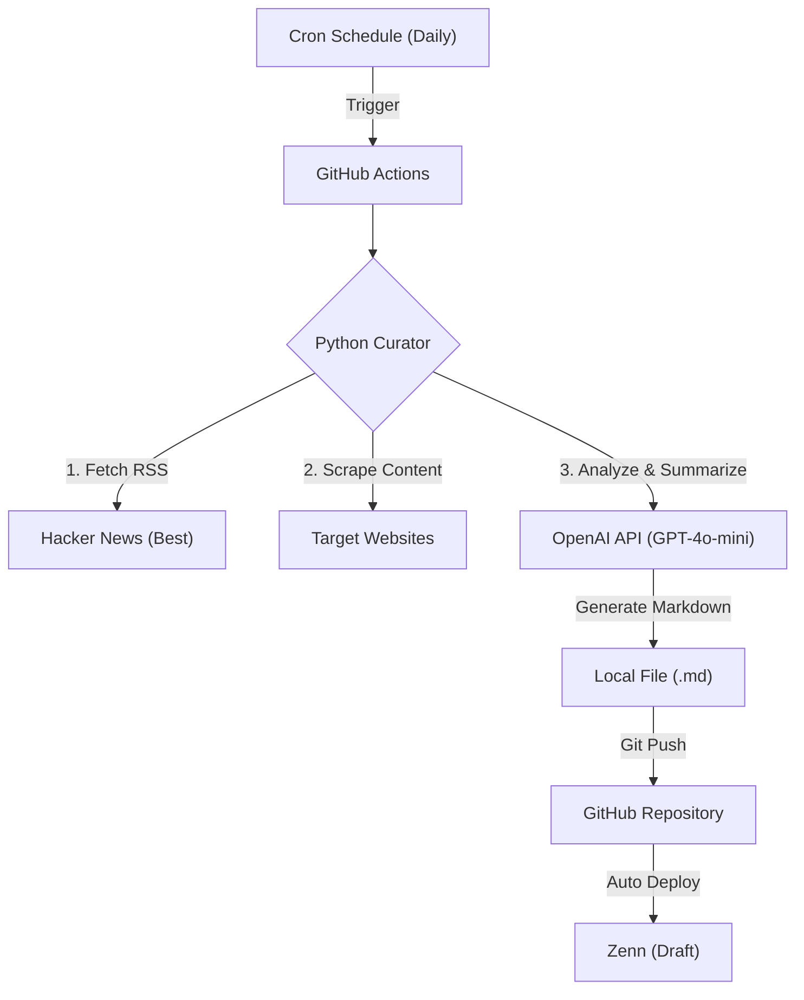

# AI-Powered News Curator 🤖

**Build your own automated news digest bot with Python, OpenAI, and GitHub Actions.**

> **Don't just read headlines. Let AI read the content for you.**

This repository provides a **fully automated pipeline** that scrapes trending tech news (Hacker News), reads the article content, summarizes it using GPT-4o-mini, and saves it as a draft for your blog (Zenn, Dev.to, Medium, etc.).

[🇯🇵 日本語のドキュメントはこちら (Read in Japanese)](./docs/README_ja.md)

## ✨ Key Features

* **Deep Content Analysis**: Unlike simple translation bots, this tool fetches the **actual HTML content** of the URL using `requests` & `BeautifulSoup` before summarization.
* **Cost Effective**: Optimized for **GPT-4o-mini**, running for less than **$0.01 per execution**.
* **Serverless Automation**: Runs entirely on **GitHub Actions**. No VPS or cloud server required.
* **Human-in-the-loop**: Generates drafts (`published: false`) to ensure quality and prevent hallucinations.

## ⚙️ Architecture

## 🚀 Quick Start

1.  **Fork this repository**.
2.  **Set your API Key**:
    * Go to `Settings` > `Secrets and variables` > `Actions`.
    * Add `OPENAI_API_KEY`.
3.  **Customize the Prompt** (Optional):
    * Edit `tools/generator.py` to change the language or tone.
    * *Default is set to Japanese output. Change the system prompt to "Summarize in English" for global use.*
4.  **Run**:
    * Go to the `Actions` tab and click **Run workflow**.

## 🛠️ Tech Stack

* **Core**: Python 3.10
* **AI**: OpenAI GPT-4o-mini
* **Scraping**: `feedparser`, `requests`, `beautifulsoup4`
* **CI/CD**: GitHub Actions

## 🤝 Contributing

Contributions, issues, and feature requests are welcome!
Feel free to check the issues page.

---
**Author**: [Your GitHub ID]
