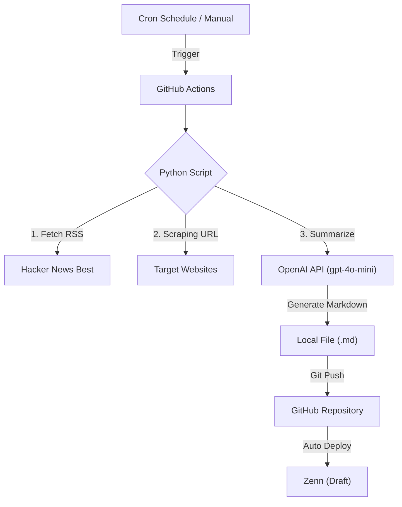

# Zenn AI Automated News Curator 🤖

海外の技術トレンド（Hacker News）を自動収集し、OpenAI API (GPT-4o-mini) を用いて日本語要約記事を生成、Zennへ下書き投稿する完全自動化パイプラインです。


## 📖 概要

このプロジェクトは、エンジニアの情報収集を効率化するために開発されました。
単純なタイトル翻訳ではなく、**記事の本文を実際にスクレイピングしてAIに読ませる**ことで、精度の高い要約を実現しています。

生成された記事は自動的にZennの「下書き」としてデプロイされ、人間による最終確認（Human-in-the-loop）を経て公開するワークフローを採用しています。

## ⚙️ アーキテクチャ



## 🚀 機能・特徴

* **Smart Curation**: Hacker Newsの "Best" カテゴリからトップ記事（7本）を自動抽出。
* **Deep Reading**: タイトルだけでなく、`requests` & `BeautifulSoup` で記事本文を取得し、内容に基づいた解説を生成。
* **Cost Optimized**: 最新の `gpt-4o-mini` モデルを採用し、高品質ながら極めて低コスト（1回数円）で運用。
* **Human-in-the-loop**: 勝手に公開せず `published: false`（下書き）状態で保存するため、誤情報の拡散を防止。

## 🛠️ 技術スタック

* **Language**: Python 3.10
* **CI/CD**: GitHub Actions (Daily Schedule: 07:00 JST)
* **AI Model**: OpenAI GPT-4o-mini
* **Libraries**:
    * `openai`: 生成AIとの通信
    * `feedparser`: RSSフィードの解析
    * `requests` / `beautifulsoup4`: Webスクレイピング
* **Platform**: Zenn (GitHub連携)

## 📂 ディレクトリ構成

```text
.
├── .github/workflows
│   └── auto_post.yml  # 自動実行の定義ファイル（毎日朝7時に起動）
├── articles/          # 生成された記事（Markdown）が格納される
├── tools/
│   └── generator.py   # 記事生成ロジックの本体
└── README.md          # 本ドキュメント
```

## 🔧 セットアップ手順

このリポジトリをForkまたはCloneして使用する場合の手順です。

1.  **環境変数の設定**:
    GitHubリポジトリの `Settings` > `Secrets and variables` > `Actions` に以下を設定してください。
    * `OPENAI_API_KEY`: OpenAIのAPIキー (`sk-...`)

2.  **スケジュールの調整**:
    `.github/workflows/auto_post.yml` の `cron` を変更することで実行時間を調整可能です。
    * デフォルト: `0 22 * * *` (UTC 22:00 = 日本時間 07:00)

3.  **手動実行**:
    GitHubの `Actions` タブから「Run workflow」ボタンを押すことで、即座に記事生成をテストできます。

## ⚠️ 免責事項

* 本システムはHacker NewsのRSSを利用しています。
* 生成されたコンテンツの正確性はOpenAIモデルの性能に依存します。
* 公開前には必ず人間によるファクトチェックを行ってください。

---
Author: [ hidexx / GitHub ID]
